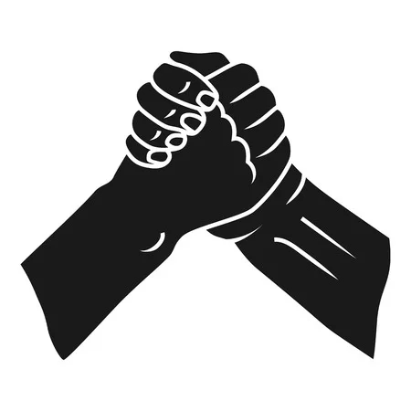

<h1 align = "center">United</h1>

# 📚About

**Our project involves a remake of the game "b00le0".**

# 🧑‍🤝‍🧑Contributors
* Pavel Yordanov - Scrum Trainer
* Ivan Chelebiev - QA Engineer
* Dimitar Vasilev - Back-end Developer
* Bozhidar Boyadzhiev - Back-end Developer

# 💻Used Technologies
     
